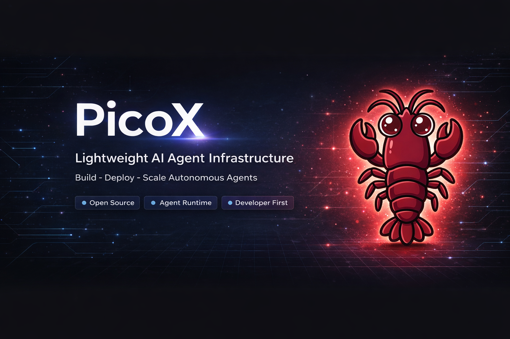
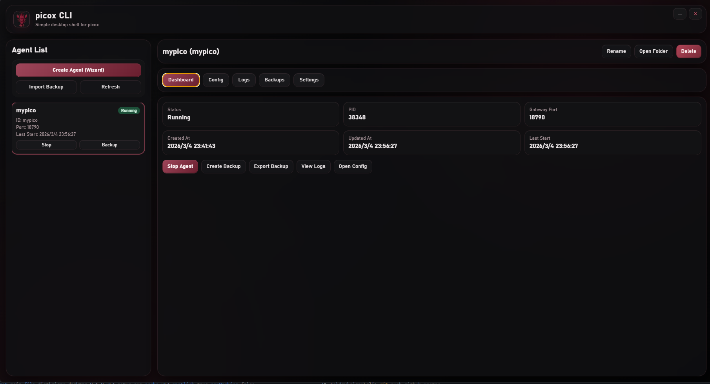
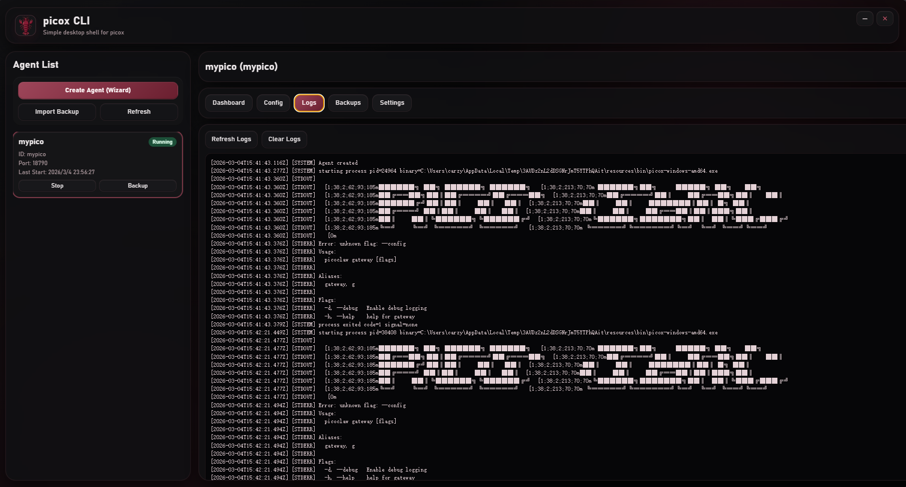

<div align="center">
  <a href="./README.md"><kbd>English (Default)</kbd></a>
  <a href="./README.zh-CN.md"><kbd>简体中文</kbd></a>
  <a href="./README.ru.md"><kbd>Русский</kbd></a>
</div>

<br />

<div align="center">
  
</div>

<div align="center">
  
</div>

# picox CLI Desktop

picox CLI Desktop 是一个基于 Electron 的桌面可视化管理工具，用来将 `picox` 的单二进制网关运行方式升级为更易用的多 Agent 运维控制台。

它面向希望保留 CLI 能力，同时提升日常操作效率的用户：创建 Agent、启动与停止、配置编辑、日志查看、备份管理，以及托盘后台运行。

## 项目能力

### 1. 多 Agent 生命周期管理

- 支持创建、重命名、删除、启动、停止多个 Agent
- 每个 Agent 独立数据目录，默认包含：
  - `config.json`
  - `workspace/`
  - `logs/runtime.log`
  - `meta.json`

### 2. 向导式创建流程

- 第一步：Agent 名称 + 模型配置（`model alias`、`model name`、`api_base`、`api_key`）
- 第二步：Telegram 配置（`enabled`、`bot token`、`allow_from`）
- 一键 `Create & Start` 自动完成：
  - 创建 Agent 目录与元数据
  - 写入映射后的 `config.json`
  - 启动网关进程

### 3. 双配置编辑模式

- `Quick Config`：常用字段表单化编辑
- `Full Config`：完整递归 JSON 编辑器
- 支持配置导入/导出

### 4. 日志与备份能力

- 日志页实时刷新（0.5 秒轮询）
- 支持日志清空
- 支持备份创建、导出、导入、恢复
- 支持把备份恢复为新的 Agent 实例

### 5. 面向长期运行的桌面体验

- 无边框窗口 + 自定义顶部控制按钮
- 关闭行为可配置：
  - 每次询问
  - 最小化到托盘
  - 直接退出
- 托盘支持：
  - 双击恢复主面板
  - 菜单快速打开/退出

## 截图

### 主控制台



### 设置与配置



## 技术栈

- Electron（main / preload / renderer 架构）
- HTML + CSS + Vanilla JavaScript
- Node.js 文件系统与进程管理
- `contextBridge` + `ipcRenderer.invoke` IPC 模型
- `electron-builder` 打包（Windows / macOS）

## 架构说明

### Main Process（`src/main`）

- 窗口生命周期与关闭策略
- 托盘生命周期与菜单行为
- Agent 进程拉起/停止
- 配置、日志、备份文件操作
- 对 renderer 暴露 IPC 接口

### Preload（`src/preload`）

- 暴露受控 API：
  - 应用初始化与设置
  - Agent CRUD 与运行控制
  - 配置/日志/备份操作
  - 目录打开与窗口控制

### Renderer（`src/renderer`）

- 多标签桌面 UI：
  - Dashboard
  - Config（Quick / Full）
  - Logs
  - Backups
  - Settings
- 向导流程与 JSON 编辑器
- 日志轮询与状态同步

## 二进制放置

请将编译后的 `picox` 可执行文件放入：

- `resources/bin/picox-windows-amd64.exe`（Windows x64）
- `resources/bin/picox-darwin-amd64`（macOS Intel）
- `resources/bin/picox-darwin-arm64`（macOS Apple Silicon）

## 快速开始

1. 安装依赖：

```bash
npm install
```

2. 放置对应平台的 `picox` 二进制到 `resources/bin/`

3. 启动开发模式：

```bash
npm run dev
```

## 构建命令

- 本地解包产物：

```bash
npm run pack
```

- Windows 安装包（NSIS）：

```bash
npm run dist:win
```

- Windows 单文件（Portable）：

```bash
npm run dist:win:portable
```

- Windows 安装包 + Portable：

```bash
npm run dist:win:all
```

- macOS DMG：

```bash
npm run dist:mac
```

## 运行数据与备份模型

运行根目录：

- `<userData>/runtime/`

Agent 目录：

- `<userData>/runtime/agents/<agent-id>/`

备份目录：

- `<userData>/runtime/backups/`

该结构便于迁移和故障恢复。你可以按 Agent 导出备份，并在另一台机器或新环境中导入恢复。

## 价值总结

- 降低 CLI 日常运维复杂度
- 通过向导和表单减少配置错误
- 通过 Full Config 保留完整灵活性
- 通过实时日志提高问题定位效率
- 通过备份导入导出提高运维安全性
- 通过托盘模式支持后台长期运行

## License

MIT
